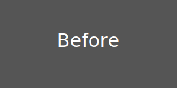
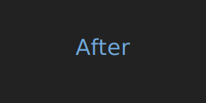

🧼 Universal Image Scraper – WooCommerce & Shopify
Un outil Python robuste et évolutif pour scraper automatiquement les images de produits sur des sites WooCommerce, Shopify et similaires.

⚙️ L’objectif est d’en faire une boîte à outils modulaire, avec une interface graphique (via PySide6), qui centralise tous les moteurs de scraping spécialisés.

📦 Fonctionnalités actuelles
✅ Téléchargement des images depuis une page produit
✅ Détection des images base64 intégrées (et sauvegarde locale)
✅ Nettoyage automatique des noms de produits / fichiers
✅ Sélecteur CSS personnalisable via l'option `--selector`
✅ Création automatique de sous-dossiers par produit
✅ Progression affichée avec tqdm
✅ Résumé final clair dans la console
✅ Extraction des noms et liens de produits d'une collection (scrap_lien_collection.py) avec sortie au format `txt`, `json` ou `csv`
✅ Récupération de la description HTML d'un produit (scrap_description_produit.py)
✅ Extraction du prix d'un produit (scrap_prix_produit.py)
✅ Nouvel onglet "Alpha" combinant variantes et liens WordPress
✅ Onglet "Alpha 2" fusionnant Alpha et Scraper Images
✅ Profil par défaut appliqué automatiquement si l'URL correspond à Shopify ou WooCommerce
Exemple : `python scrap_lien_collection.py https://exemple.com/collection --selector "div.product a" --format csv`

### Utilisation du scraper d'images
Exemple : `python scraper_images.py https://exemple.com/produit --max-threads 8`
L'option `--max-threads` définit le nombre maximal de téléchargements parallèles (4 par défaut).

Pour tester ou générer rapidement un sélecteur CSS depuis un extrait HTML,
utilisez `find_css_selector.py`. En ligne de commande :

```
python find_css_selector.py page.html
```

Ou lancez l'interface graphique (PySide6 requis) avec :

```
python find_css_selector.py --gui
```


🛠️ Dépendances

Installez les bibliothèques nécessaires avec :

```bash
pip install -r requirements.txt
```

🔧 Configuration

Copiez d'abord `settings.example.json` vers `settings.json` puis personnalisez ce dernier localement :

```bash
cp settings.example.json settings.json
```

Adaptez ensuite `settings.json` en fonction de vos préférences. Ce fichier de configuration personnel reste local car il est listé dans `.gitignore`.

🔄 Mise à jour de l'application
Un bouton "Mettre à jour l'app" exécute `git pull` puis redémarre le programme. L'opération nécessite une connexion réseau et peut entraîner des conflits si vous avez modifié le code localement. Une confirmation est demandée avant l'exécution et les erreurs réseau sont affichées clairement. Vous pouvez désactiver cette fonctionnalité en plaçant `"enable_update": false` dans `settings.json`.

🛜 Mode hors-ligne
Si votre machine n'a pas accès à internet, renseignez le chemin vers un ChromeDriver déjà installé en local via la clé `"driver_path"` de `settings.json`. L'application utilisera alors ce binaire au lieu de tenter un téléchargement automatique.

🗒️ Suivi des audits
Les rapports d'audit sont enregistrés dans `compte_rendu.txt`. Mettez ce fichier à jour à chaque nouvel audit. Pour consulter les derniers résultats, ouvrez `compte_rendu.txt` ou exécutez `cat compte_rendu.txt` dans votre terminal.

🧪 Tests unitaires
Après installation des dépendances, lancez simplement :
```bash
pytest
```

## Captures d'ecran

L'interface profite maintenant d'icones et d'un style adapte aux ecrans haute densite.

Avant:



Apres:


